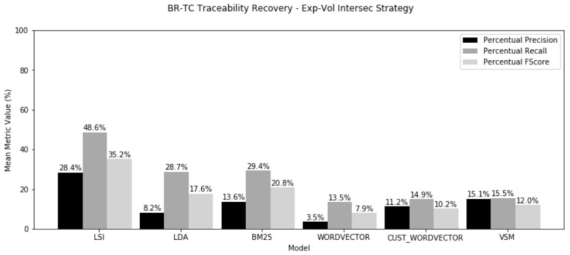

# Traceability Recovery between Bug Reports and Test Cases - a case study

## Abstract

**(Context)** Automatic traceability recovery between software arti-facts may promote early detection of issues. Information Retrieval (IR) tech-niques have been proposed for the task, but they differ considerably in inputparameters and results. It is difficult to assess results when those techniquesare applied in isolation, usually in small or medium-sized software projects.Recently, multilayered approaches to machine learning, in special Deep Learn-ing (DL), have achieved success in text classification through their capacity tomodel complex relationships among data.
**(Objective)** In this article, we ap-ply several IR and DL techniques for investing automatic traceability betweenbug reports and manual test cases, using historical data from the Mozilla Fire-fox quality assurance (QA) team.
**(Method)** In this case study, we assess thefollowing IR techniques: LSI, LDA, and BM25, in addition to a DL architec-ture called Convolutional Neural Networks (CNNs), through the use of WordEmbeddings.
**(Results)** In this context of traceability, we observe poor perfor-mances from three out of the four studied techniques. Only the LSI techniquewas effective, standing out even over the state-of-the-art BM25 technique.
**(Conclusions)** The obtained results suggest that the semi-automatic appli-cation of the LSI technique – with an appropriate combination of thresholds– is feasible for real-world software projects.



## Repository

This repository contains the data, scripts and notebooks to reproduce the experiments of our research work.

* **Data**

    The scripts used to collect and analyze the data and the datasets of bug reports, system features and test cases used and formatted are presented in the [data](data/) folder. Further details can be found in its [README](data/mozilla_firefox_v2/README.md) file.

* **Preprocessing**

    The preprocessing notebooks can be found in the [preprocessing](preprocessing/) folder. Further details are in its [README](preprocessing/README.md) file.

* **Modules**

    The python scripts used are in [modules](modules/) folder.

* **Notebooks**

    All the notebooks used to run and analyze the results are the [notebooks](notebooks/) folder. Further details are in the corresponding [README](notebooks/README.md) file.

## Arxiv

Here is [the link](https://arxiv.org/pdf/xxxxx.xxxxx.pdf) for our arxiv version. 

## Citation

Welcome to cite our work if you find it is helpful to your research.
```
@article{gadelha2021,
  title={Traceability Recovery between Bug Reports and Test Cases - a case study},
  author={Gadelha, Guilherme and Ramalho, Franklin and Massoni, Tiago},
  journal={},
  volume={},
  year={}
}
```

##  Experiments Environment

We runned all the experiments on an `AMD Ryzen 5 3600 6-core` processor machine with `23GB` of memory and `Ubuntu 20.04 LTS` operational system. 

We use a [conda environment](https://docs.conda.io/projects/conda/en/latest/user-guide/tasks/manage-environments.html#creating-an-environment-from-an-environment-yml-file) with `python3.7` and a predefined [environment.yml](environment.yml) file to create and configure the environment for us. 

To create a `trace-links-tc-br` conda environment with `python3.7` and all the required packages, clone this repository and execute the following command into the downloaded repository folder:

        conda env create -f environment.yml

Then you will note the creation of `traces-links-tc-br` in _~/anaconda3_ folder. Activate this enviroment and execute the commands bellow to download the necessary SpaCy models.

        conda activate trace-links-tc-br
        cd ~/anaconda3/trace-links-tc-br
        python -m spacy download en_core_web_sm
        python -m spacy download en_vectors_web_lg

## Note
If any link is invalid or you have any question, please email guilherme@copin.ufcg.edu.br.


